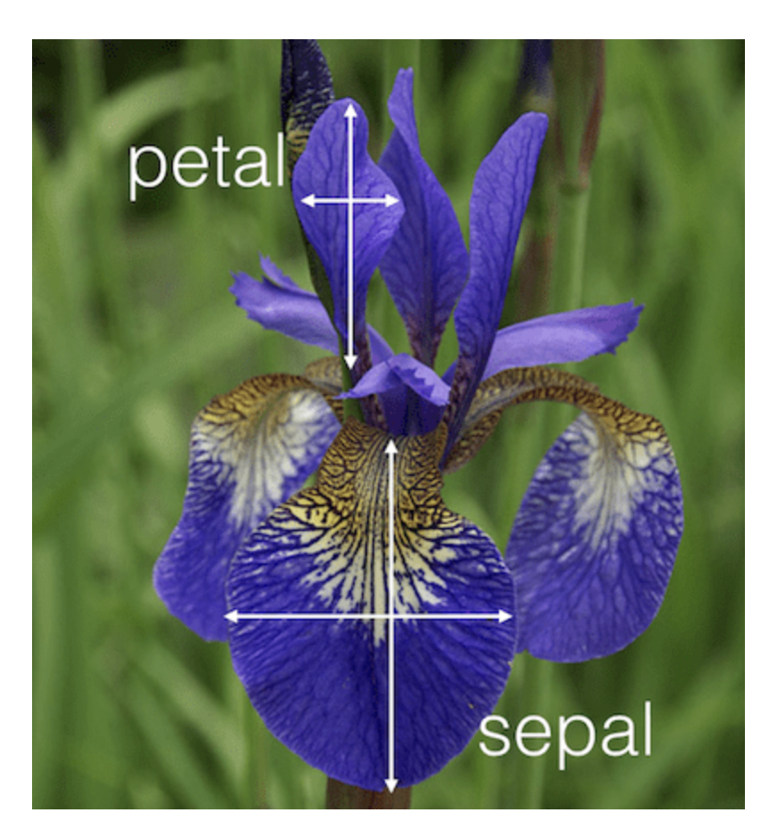
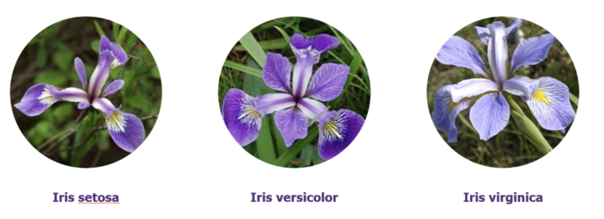

# K Nearest Neighbors (KNN) algorithm
In this Machine Learning world, there are various algorithms designed for classification problems such as Logistic Regression, Decision Tree, Random Forest, Gradient Boosting over Decision Trees, etc. and KNN is not exceptional. When approaching to a classification problem, off the top of my head I will come up with the algorithm (KNN) first because it may be the most basic and simple algorithm to implement. In this project, I'm going to build a KNN model to do tasks on classifying flower types in the dataset Iris.

## About data

    

The dataset I'm going to use is a flower dataset called [Iris](https://archive.ics.uci.edu/ml/datasets/iris). This is a bit of information about this dataset that you should care about:
- The data set contains 3 classes (Iris Setosa, Iris Versicolor, Iris Virginica) of 50 instances each, where each class refers to a type of iris plant.
- There are 4 attributes in total, which are **sepal length in cm**, **sepal width in cm**, **petal length in cm**, **petal width in cm**.
- Classes: Iris setosa, Iris versicolor, Iris virginica

## Environment
MacOS Monterey 12.1, Anaconda Virtual Environment, Python 3.9.7 64-bit

## Requirements
1. [Numpy](https://numpy.org/)
2. [Pandas](https://pandas.pydata.org/)
3. [Scikit-learn](https://scikit-learn.org/stable/)

## KNN procedures
1. Load the data
2. Initialise the value of K
3. For getting the predicted class, iterate from 1 to the total number of training data points
    3.1 Calculate the distance between a test sample and each row of training data. Here we will use L2 norm (Euclidean distance) as our distance metric since it’s the most popular method
    3.2 Sort the calculated distances in ascending order based on distance values
    3.3 Get top K nearest neighbors from the sorted array
    3.4 Get a class with the maximum number of votes
    3.5 Return the predicted class

## How to run this program
In your project folder, open a terminal and run `python knn.py`

## Result

## Reference:
For more information about the KNN algorithm, please follow this link:
- [Introduction to K-Nearest Neighbors: A powerful Machine Learning Algorithm](https://www.analyticsvidhya.com/blog/2018/03/introduction-k-neighbours-algorithm-clustering/?#)
